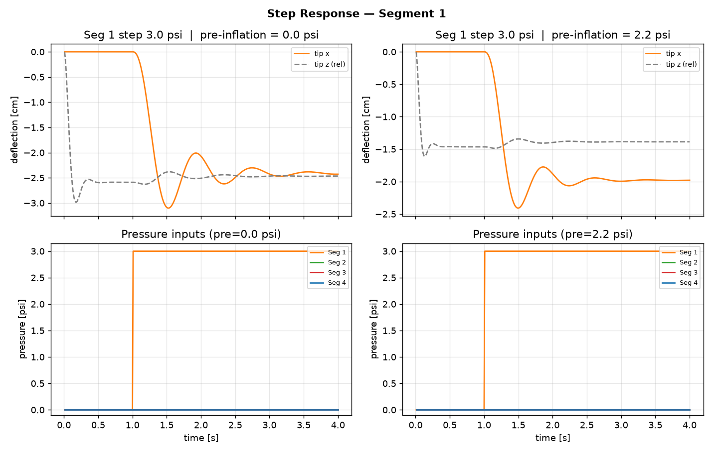
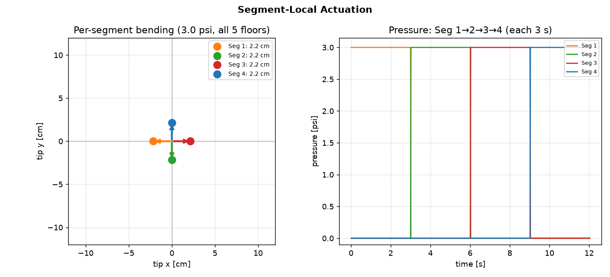
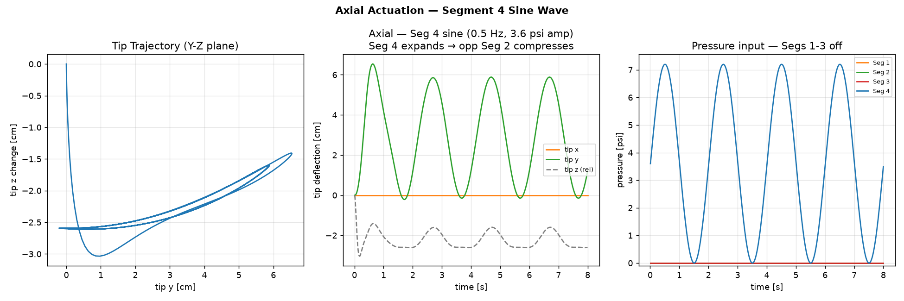
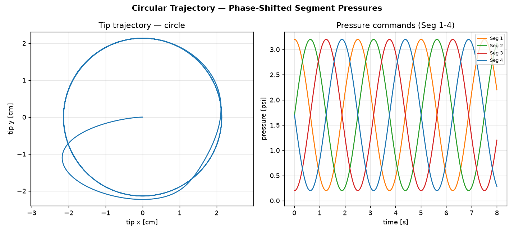
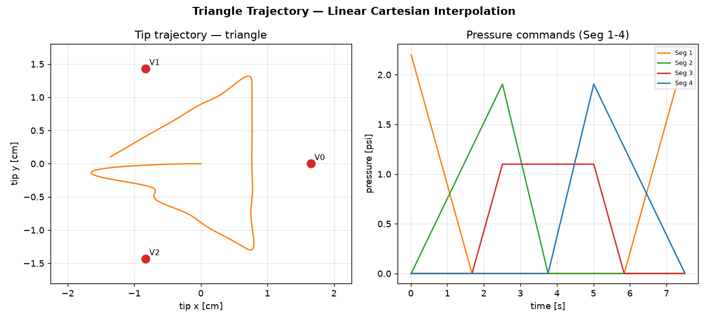

# Soft Robotic Arm Digital Twin Simulation

This repository contains the MuJoCo-based digital twin simulation for a 4-column, 5-level pneumatic soft robotic arm. 

## Setup Instructions

### Prerequisites
- Python 3.9+
- `uv` package manager (recommended for fast virtual environment setup)

### Installation
1. Clone this repository and checkout the simulation branch:
   ```bash
   git clone -b simulation https://github.com/Jeevan-HM/Soft-Robotic-Arm.git
   cd Soft-Robotic-Arm
   ```

2. Sync the dependencies using `uv`:
   ```bash
   uv sync
   ```
   *(Alternatively, use `pip install -r pyproject.toml` or install `mujoco`, `numpy`, `matplotlib`, `imageio[ffmpeg]` manually)*

### Running the Simulation
To run the full suite of validation demos (Step response, axial extension, circular and triangular trajectories):
```bash
uv run demo.py
```
All generated plots and videos will be saved into the `output/` directory.

**Example Video Output (Circular Trajectory):**

https://github.com/Jeevan-HM/Soft-Robotic-Arm/raw/simulation/output/soft_arm_demo.mp4

---

## 1. Physical Architecture
The robotic arm is modeled as 4 pneumatic segment columns (Seg 1-4) arranged in a square cross-section, with 5 floor levels stacked vertically.
- **Seg 1**: East (Azimuth 0°), Orange
- **Seg 2**: North (Azimuth 90°), Green
- **Seg 3**: West (Azimuth 180°), Red
- **Seg 4**: South (Azimuth 270°), Blue

**Kinematics (15 DOFs):** 
Each of the 5 floor levels consists of a nested rigid body with:
- `slide` joint for axial extension/compression
- `hinge` joint for X-axis bending
- `hinge` joint for Y-axis bending

## 2. Geometry & Physics Parameters
- **Arm Length:** 22.0 cm (rest length)
- **Column Offset:** 2.8 cm (from arm center)
- **Column Outer Radius:** 1.8 cm
- **Total Moving Mass:** 0.35 kg
- **Max Pressure Limit:** 10.0 psi
- **Base Stiffness:** 0.30 N·m/rad
- **Axial Stiffness:** 600.0 N/m

**Wrench Mappings (Pressure -> Force):**
- **Bending Gain:** 0.552 N/psi (per column per level)
- **Axial Gain:** 0.034 N/psi (per column per level)
- **Pre-inflation Stiffness Scaling:** 0.414 / psi

## 3. Waveforms and Validation

### Step Response
- **Goal:** Analyze dynamic response to an instantaneous command.
- **Waveform:** 3.0 psi step on Seg 1 (all 5 floors) starting at t=1.0s.
- **Analysis:** Demonstrates the effect of stiffness-modulating pre-inflation (0.0 psi vs 2.2 psi). Higher pre-inflation leads to a stiffer arm, resulting in smaller tip deflection.



### Segment-Local Actuation
- **Goal:** Verify multi-segment symmetry and independent bending directions.
- **Waveform:** Independent 3.0 psi constant commands delivered sequentially to each segment (Seg 1 → Seg 2 → Seg 3 → Seg 4).
- **Analysis:** Results map perfectly to expected Cartesian axes (East, North, West, South) with symmetric deflection magnitudes (~2.2 cm).



### Axial Extension / Single Segment Oscillation
- **Goal:** Validate passive compression and dynamic axial coupling.
- **Waveform:** 0.5 Hz sine wave on Seg 4 only. Amplitude = 3.6 psi, DC Offset = 3.6 psi (pressure bounded 0-7.2 psi). Segs 1-3 remain off (0 psi).
- **Analysis:** Seg 4 expands axially while structurally coupling forces compress the opposite Seg 2, causing the arm to oscillate cleanly in the Seg 4–Seg 2 plane.



### Circular Trajectory
- **Goal:** Verify smoothly rotating bending moments for trajectory tracking.
- **Waveform:** Phase-shifted cosine pressure commands to all segments (0.4 Hz orbit frequency). Amplitude = 1.5 psi, DC Offset = 1.7 psi.
- **Analysis:** Tip accurately traces a circle in the XY plane.



### Triangular Trajectory
- **Goal:** Verify tracking of sharp transitions and straight-line Cartesian paths between vertices.
- **Waveform:** Target coordinates (X, Y) are linearly interpolated between 3 vertices (equilateral triangle) and projected onto the column axes. 2.5s per triangle edge. Peak amplitude = 2.2 psi.
- **Analysis:** Proves the parallel multi-column architecture can reliably compose complex target shapes.


